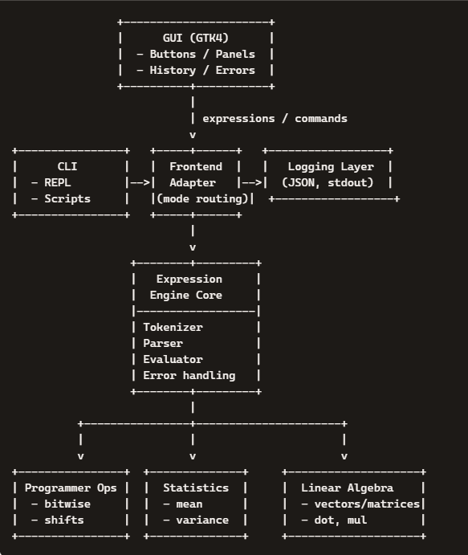

**Chapter** **II—Introduction**

Before modern scientific libraries, programmers relied on command-line
tools and hardware calculators to perform arithmetic, bitwise
operations, and statistical analysis. In **CALC42**, you will build
a**multi-mode** **calculator** **suite**consistingof:

> • A **core** **computation** **engine**written in C
>
> • A **CLI** **calculator**
>
> • A **GUI** **calculator**using**GTK4**
>
> • Support for:
>
> o Standard arithmetic
>
> o Programmer operations
>
> o Statistics
>
> o Probability
>
> o Discrete math
>
> o Linear algebra (NumPy-lite)

This is a **solo** **project**.

**Chapter** **III—Overview**

You must deliver:

> • A **shared** **computation** **engine**(pure C, no global state)
>
> • A **CLI** **calculator**
>
> • A **GTK4GUI** **calculator**
>
> • A **modular** **architecture**allowing new modes to be added easily
>
> • A **build** **system**(Makefile or CMake)
>
> • A **README**with detailed documentation
>
> • A **robust,** **crash-free,** **leak-free** **implementation**

**Supported** **Calculator** **Modes**

> **Mode**
>
> **Standard** **Calculator**

**Required** **Features**

+, −, ×, ÷, %, parentheses, precedence, expression parser

> **Programmer** **Calculator** hex/bin/oct/dec, bitwise ops,
> shifts,masks, signed/unsigned
>
> **Statistics**
>
> **Probability**
>
> **Discrete** **Math**
>
> **Linear** **Algebra**

mean, median, mode, variance, stddev, z-score, correlation

nCr, nPr, binomial distribution, geometric distribution

gcd, lcm, modular arithmetic, sets, logic operators

vectors, dot product, matrix × vector, 2×2 and 3×3 matrices

**Chapter** **IV—Global** **Rules**

> • Language:**C** **only**
>
> • GUI:**GTK4(mandatory)**
>
> • No externalmath libraries (implement your own)
>
> • No Python
>
> • All calculations must be deterministic
>
> • CLI andGUI must use the same computation engine
>
> • GUI must remain responsive (threadingor async)
>
> • All errorsmust be handled gracefully
>
> • **No** **memory** **leaks**(valgrind clean)
>
> • **No** **crashes**(robust error handling)
>
> • **No** **undefined** **behavior**
>
> • Code must pass yourchosen linter (norminette, clang-tidy, etc.)

**Chapter** **V** **—MandatoryPart**

**V.1** **Core** **Computation** **Engine**

You must implement:

> • Tokenizer
>
> • Parser (shunting-yard or recursive descent)
>
> • Evaluation engine
>
> • Modularoperation registry
>
> • Error handling(syntax, overflow, domain errors)
>
> • Memory-safe dynamicarrays
>
> • Optional: small custom allocator for performance

The engine must support:

> • Arbitrary-length expressions
>
> • Operator precedence
>
> • Unary operators
>
> • Floating-pointand integer modes
>
> • Mode-specific operations (bitwise, matrix, etc.)

**V.2** **CLI** **Calculator**

> • Reads expressions from stdin
>
> • Supports interactive and one-shot modes
>
> • Displays errors clearly
>
> • Supports history (optional)
>
> • Supports switching modes (e.g., :mode programmer)
>
> • Must remain responsive while evaluating longexpressions
>
> • Must notblock on invalid input

**V.3** **GUI** **Calculator** **(GTK4)**

The GUI must include:

**Layout**

> • Standard calculator layout
>
> • Programmer panel
>
> • Statistics panel
>
> • Probability panel
>
> • Linear algebra panel
>
> • Error display
>
> • Expression display
>
> • Result display

**Features**

> • Buttons for all operations
>
> • Base selector (bin/oct/dec/hex)
>
> • Bitwise operation buttons
>
> • Matrix/vector input widgets
>
> • Scrollable history
>
> • Threaded evaluation for longoperations
>
> • Graceful error popups
>
> • No freezing or blockingUI

**V.4** **Robustness** **Requirements**

Your project must:

> • **Never** **leak** **memory**
>
> o Verified with valgrind
>
> o No reachable blocks
>
> o No invalid reads/writes
>
> • **Never** **crash**
>
> o All pointers validated
>
> o All allocations checked
>
> o All user input sanitized
>
> • **Never** **hang**
>
> o Longcomputations must run in a worker thread
>
> o GUI must remain responsive
>
> • **Never** **corrupt** **memory**
>
> o No buffer overflows
>
> o No use-after-free
>
> o No double-free
>
> • **Handle** **all** **errors** **gracefully**
>
> o Syntax errors
>
> o Domain errors
>
> o Overflow
>
> o Underflow
>
> o Invalid matrix sizes
>
> o Division by zero

**V.5** **Logging**

> • Log all expressions
>
> • Log errors
>
> • Log mode switches
>
> • LogGUI interactions
>
> • Use structured logging (JSON recommended)
>
> • Optional: log to file + stdout

**V.6** **Example** **Interactions**

**Standard** **mode**

Code

\> 3+4 \* 2

= 11

**Programmer** **mode**

Code

\> 0xFF &0x0F

= 0x0F

**Statistics**

Code

\> mean \[1, 2,3, 4, 5\]

= 3

**Probability**

Code

\> nCr(10, 3)

= 120

**Linear** **algebra**

Code

\> dot(\[1,2,3\], \[4,5,6\])

= 32

**Chapter** **VI** **—README** **Requirements**

Your README must include:

> • *This* *project* *has* *been* *created* *as* *part* *of* *the*
> *42curriculum* *by* *\<login\>.*
>
> • Description
>
> • Instructions
>
> • Architecture
>
> • Computation engine design
>
> • Parser design
>
> • Mode system design
>
> • GUI design
>
> • Logging
>
> • Testing
>
> • Memory safety strategy
>
> • Error handling strategy
>
> • Group contributions (solo = explain your workflow)
>
> • Resources
>
> • AI usage disclosure

**Chapter** **VII—Submission** **and** **Evaluation**

**Repository** **must** **contain**

> • src/
>
> • include/
>
> • engine/
>
> • cli/
>
> • gui/
>
> • Makefile
>
> • README.md
>
> • tests/ (optional but recommended)

**Evaluation**

You must be able to:

> • Modify a small part of the parser
>
> • Add a new operator
>
> • Fix a bug in the GUI
>
> • Explain your architecture
>
> • Demonstrate all modes live
>
> • Show valgrind-clean output
>
> • Show no crashes under fuzzed input
>
> **Future** **Roadmap** **for** **CALC42**

A strong roadmap shows that the project is designed withgrowth in mind.
These milestones are realistic, technically meaningful, and aligned with
the architecture you’ve already defined.

**Phase** **1—Core** **Enhancements** **(Short-Term)**

Focus: stability, correctness, and developer experience.

**1.** **Improve** **the** **Expression** **Parser**

> • Add support for function calls: sin(x), log(x), sqrt(x)
>
> • Add user-defined variables
>
> • Add user-defined functions
>
> • Add implicit multiplication (2x, 3(4+1))

**2.** **Expand** **Programmer** **Mode**

> • Add bitfield visualizer
>
> • Add memory layout inspector (endianness, byte order)
>
> • Add signed/unsigned overflow detection

**3.** **Improve** **Error** **Reporting**

> • Show errorposition in expression
>
> • Provide suggestions (“Did you mean…?”)
>
> • Add recovery mode formalformed input

**Phase** **2—Numerical** **Extensions** **(Mid-Term)**

Focus: more powerful math capabilities.

**1.** **Matrix** **&** **Vector** **Improvements**

> • Add matrix inversion (2×2, 3×3)
>
> • Add determinant calculation
>
> • Add matrix decomposition (LU for small matrices)
>
> • Add vector normalization and projection

**2.** **Statistics** **&** **Probability**

> • Add linear regression
>
> • Add covariance matrices
>
> • Add probability densityfunctions (PDF)
>
> • Add cumulative distribution functions (CDF)

**3.** **Discrete** **Math**

> • Add prime factorization
>
> • Add modular exponentiation
>
> • Add set operations (union, intersection, difference)

**Phase** **3—Performance** **&** **Architecture** **(Long-Term)**

Focus: speed, scalability, and advanced features.

**1.** **Custom** **Memory** **Allocator**

> • Arena allocator for parser tokens
>
> • Pool allocator for matrices
>
> • Reduce malloc/free overhead
>
> • Improve cache locality

**2.** **SIMD** **Acceleration** **(Optional)**

> • Use SSE/AVX for vector/matrix operations
>
> • Use compiler intrinsicsfor hot loops
>
> • Provide fallback for non-SIMD systems

**3.** **Plugin** **System**

> • Allow users to add new operations at runtime
>
> • Dynamic loading via shared libraries(.so, .dll)
>
> • Register new functions/operators without recompiling

**4.** **Scripting** **Layer**

> • Add a tiny scriptinglanguage for automation
>
> • Support loops, conditionals, and variables
>
> • Allow batch processingof expressions

**Phase** **4—UX** **&** **GUI** **Evolution** **(Long-Term)**

Focus: polish, usability, and user experience.

**1.** **History** **&** **Session** **Management**

> • Persistent history
>
> • Export/import sessions
>
> • Tag and annotate calculations

**2.** **Visualizations**

> • Plot functions (2D)
>
> • Plot statistical distributions
>
> • Visualize matrices as heatmaps

**3.** **Accessibility**

> • Keyboard-only mode
>
> • High-contrast theme
>
> • Screen reader support
>
> **Best** **Practices** **for** **Optimization** **in** **CALC42**

These recommendations help you keep the project fast, memory-safe, and
maintainable.

**1.** **Keep** **the** **Core** **Engine** **Pure** **and**
**Stateless**

> • No global variables
>
> • No hidden state
>
> • All functions receive explicit inputs and outputs

This makes the enginepredictable and easy to test.

**2.** **Minimize** **Dynamic** **Allocations**

Dynamic memory is expensive.Use:

> • Stack allocation for small arrays
>
> • Reusable buffers
>
> • Arena allocators for parsing
>
> • Pool allocators for matrices

This reduces fragmentation and improves cache locality.

**3.** **Use** **Efficient** **Data** **Structures**

> • Use **dynamic** **arrays**instead of linked lists
>
> • Use **struct-of-arrays**for matrices when possible
>
> • Use **hash** **tables**for variables and functions

Avoid pointer-heavy structures that cause cache misses.

**4.** **Optimize** **the** **Parser**

The parser is called constantly.Improve it by:

> • Using the **shunting-yard** **algorithm**
>
> • Precomputing operatorprecedence
>
> • Avoiding recursion where possible
>
> • Reusing token buffers

**5.** **AvoidRepeated** **Computation**

Cache results when possible:

> • Memoize expensive functions
>
> • Cache matrix determinants
>
> • Cache parsed expressions for repeated evaluation

**6.** **Use** **Inline** **Functions** **for** **Small** **Operations**

Examples:

> • Vector addition
>
> • Scalarmultiplication
>
> • Bitwise operations

Inlining reduces function call overhead.

**7.** **Profile** **Before** **Optimizing**

Use tools like:

> • valgrind --tool=callgrind
>
> • gprof
>
> • perf

Optimize only the real bottlenecks.

**8.** **Keep** **the** **GUI** **Thread** **Clean**

> • Never compute in the GTK main thread
>
> • Use worker threads forevaluation
>
> • Use message passing (GTask, GMainContext)

This prevents UI freezes.

**9.** **Validate** **All** **Inputs**

Avoid crashes by validating:

> • Matrix dimensions
>
> • Division by zero
>
> • Overflow/underflow
>
> • Invalid tokens
>
> • Empty expressions

Robustness is part of performance —crashescost time.

**10.** **Write** **Tests** **for** **Everything**

Especially:

> • Parser
>
> • Tokenizer
>
> • Matrix operations
>
> • Probability functions
>
> • Edge cases

A stable codebase is easier to optimize.

**Performance** **checklist**

> • **Profile** **first:**
>
> o Run with valgrind --tool=callgrind orperf on real workloads.
>
> • **Minimize** **allocations:**
>
> o **Tokenizer:**reuse token buffers.
>
> o **Parser:**use an arena for AST nodes.
>
> o **Matrices/Vectors:**use fixed-size or pooled allocations where
> possible.
>
> • **Avoid** **unnecessary** **copies:**
>
> o Pass large structs by pointer.
>
> o Reuse result buffers instead of reallocating.
>
> • **Cache** **hot** **data:**
>
> o Cache parsed expressions for repeated evaluation.
>
> o Cache small matrix operations (e.g., determinants) if reused.
>
> • **Tight** **loops:**
>
> o Keep inner loops small and branch-light.
>
> o Consider inline fortiny math helpers.
>
> • **Separate** **UI** **and** **compute:**
>
> o Never block GTK main loop.
>
> o Use worker threads forevaluation and post results back to UI.

**Testing** **plan**

> • **Unit** **tests** **(engine):**
>
> o **Tokenizer:**valid/invalid tokens, edge cases (1e-9, 0xFF, ()).
>
> o **Parser:**precedence, associativity, unary ops, parentheses.
>
> o **Evaluator:**arithmetic,programmer ops, stats,probability, linear
> algebra.
>
> • **Property-based** **tests** **(where** **possible):**
>
> o a + b == b+ a(within tolerance).
>
> o dot(a, b)== dot(b, a) forreal vectors.
>
> o det(A \* B) == det(A) \* det(B) for small matrices.
>
> • **Error-path** **tests:**
>
> o Division by zero.
>
> o Mismatched brackets.
>
> o Invalid matrix dimensions.
>
> o Overflow/underflow scenarios.
>
> • **Integration** **tests:**
>
> o CLI: scripted sessions via input files, compare outputs.
>
> o GUI: smoke tests (start, switch modes, run sample expressions).
>
> • **Regression** **tests:**
>
> o Add a test for every bugyou fix.
>
> • **Fuzzing** **(bonus):**
>
> o Fuzz the expression input (CLI)and ensure nocrashes / UB.

**Memory-safety** **checklist**

> • **Allocation** **discipline:**
>
> o Check every malloc/calloc/realloc return.
>
> o Centralize allocation helpers if possible.
>
> • **Ownership** **rules:**
>
> o Define clearly: who allocates, who frees.
>
> o Avoid shared ownership without a clear protocol.
>
> • **Lifetimes:**
>
> o No pointers to stack memory stored beyond scope.
>
> o No use-after-free; null out pointers after free.
>
> • **Bounds** **safety:**
>
> o Always check indices for vectors/matrices.
>
> o Use size fields in all dynamiccontainers.
>
> • **Valgrind** **clean:**
>
> o Run valgrind on:
>
> ▪ CLI normal session.
>
> ▪ CLI with invalid inputs.
>
> ▪ GUI basic interaction.
>
> • **Thread** **safety:**
>
> o No shared mutable state between GUI and worker threads without
> synchronization.
>
> o Avoid sharing raw pointers across threads unless carefully managed.

